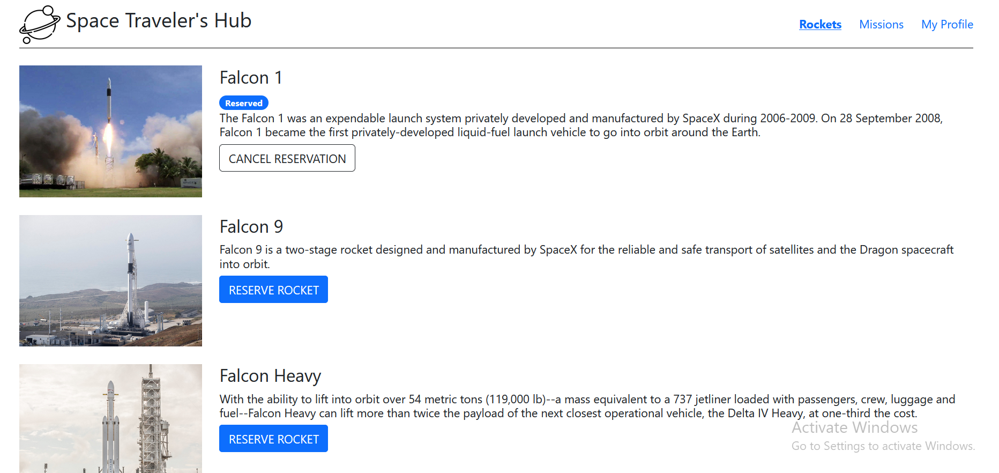
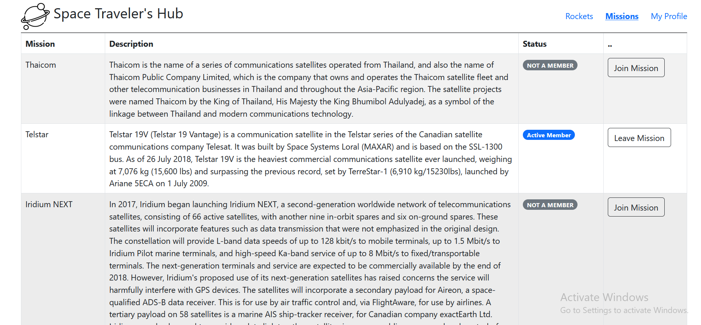
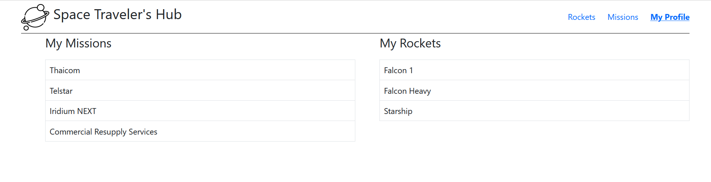

# Space-travellers-react-redux

"Space-travellers" is a website for displaying spaceX API items. It is a Single Page App (SPA) that allows users to:
- Reserve a spot on misson.
- Reserve a spot on rocket.
- Check all the rockets and missons reserved.

  

  
  
  

### LiveLink
[Link](https://sharp-goldberg-87b81e.netlify.app/)

### Project Requirements
- Set up Git flow
- create a React application is using Create React App (CRA) 
- Set up linters
- Create components and build the calculator app interface
- Use given logic files for calculator functions
- Implement event handlers
- Refactor with hooks
- Add multi-pages and implement routing
- Add styling with React basic styling

## Built With
- JS
- CSS
- JSX
- React

## Getting Started

### Prerequisites

- Node.js
- npm

### Setup

Clone the project:

```
git clone https://github.com/blakbox23/Space-travellers-react-redux
```

### Run project

Install dependencies:

```
npm install
npm update
npm start
```

## Author's

👤 **Peter Mbuthia** 

- GitHub: [@Blakbox23](https://github.com/blakbox23) 
- Twitter: [@blakbox23](https://twitter.com/blakbox23) 
- LinkedIn: [Peter Mbuthia](https://www.linkedin.com/in/peter-mbuthia) 

👤 **Igor Koloski**  

- GitHub: [@igorkol91](https://github.com/igorkol91)
- Twitter: [@Destro49536502](https://twitter.com/Destro49536502)
- LinkedIn: [Koloski Igor](https://www.linkedin.com/in/igor-koloski-a754aa208/)

## 🤝 Contributing

Contributions, issues, and feature requests are welcome!

## Show your support

Give a ⭐️ if you like this project!

## 📝 License

This project is [MIT](./MIT.md) licensed.